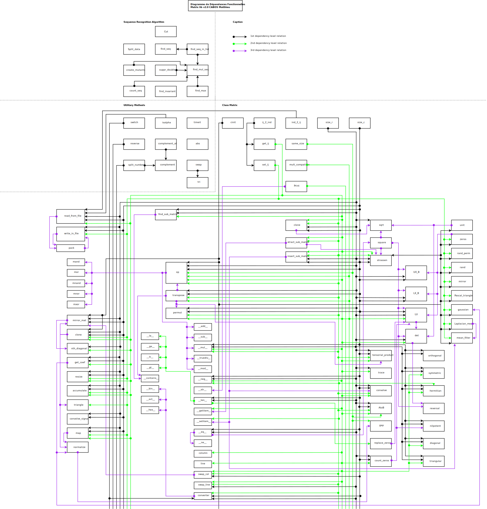

.. Matrix documentation master file, created by
   sphinx-quickstart on Thu Jul  2 10:13:17 2020.
   You can adapt this file completely to your liking, but it should at least
   contain the root `toctree` directive.

Welcome to Matrix's documentation!
==================================

Welcome in the CMatrix Module. 
This module, written with python and Cython, is as fast as a c/c++ Librairie file.
It has been thinked for Matrix complex computation.
This Module have been splitted into three main parts :

	* **A Matrix Generators Section**
		The Matrix Generators section permit to generate automatically standard algebrica matrix as :

		* **A Laplacian mean Matrx**
		* **A Gaussian mean Matrix**
		* **A Mean filter Matrix**
		* **A Random Permutation Matrix**
		* **A Unit Matrix**
		* **A Zeros Matrix**

	* **A Sequence Recognition Section**
		This Sequence Recognition Algorithm permit us to find in any list any repeated sequence from **nothing** .
		This Algorithm is splitted into 10 functions : 1 main algorithm and 9 sub-function.
		The main algorithm function name is find_mul_seq, meaning Find Multiples Seqneces function.
		The 9 sub-functions used to make it works are :

		* **count_seq** : A sequence counter
		* **create_mutants** : A list mutants generator function
		* **cut** : A list cutter function
		* **find_invariant** : An invariant finder function
		* **find_max** : Get the max length list function
		* **find_seq** : A sequence finder function
		* **find_seq_in_list** : An advanced sequence finder function
		* **split_data** : Data splitter function
		* **split_number** : A number splitter function

	* **The Main Matrix Engine**
		The main matrix engine define an new Matrix Object into your Python code.
		This matrix should be extracted and readed from :

		* **Pictures**
		* **Video**
		* **Signals**
		* **Float and Int matrix**
		* **etc**

		To read a matrix from an external file, you can use the Matrix Getter py file into the main github repository to extract and use any matrix with this lib.
		It contains differents kind of function :

		* Primary utility functions as Ribbon converter, usual operators, ...
		* Middle level functions as Matrix extraction/recognition, usuals algebrica operations, ...
		* Hard level functions as Strassen algorithm, Convolutions, System resolution, Tensorial operations, ...

The full description of each part is avaible on the left tree entries.
All the functions are documented and a small example will be used as an Usage Guide.

Here you will find the main Scheme to have a global look on this module.

.. toctree::
   :maxdepth: 2
   :caption: Contents:

   Introduction
   Usage
   Functions
   Matrix

Indices and tables
==================

* :ref:`genindex`
* :ref:`modindex`
* :ref:`search`